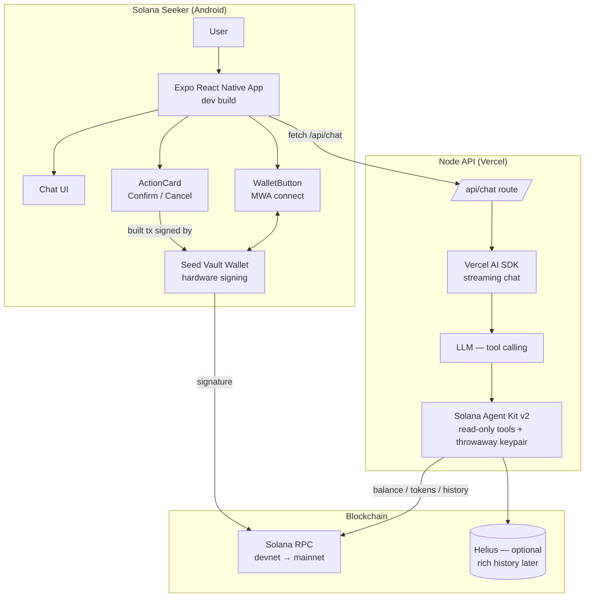
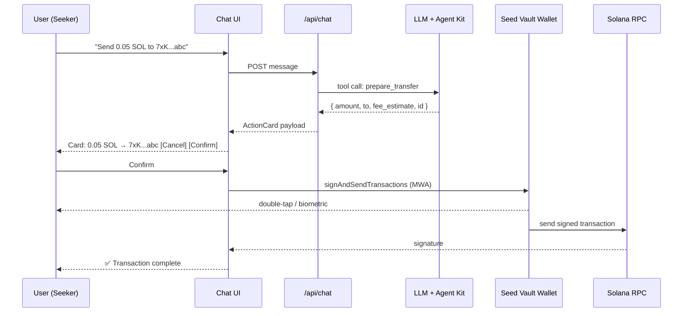
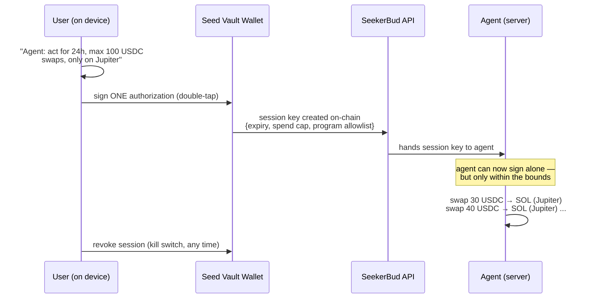

# SeekerBud

> **SeekerBud — your AI companion for everything Solana.**

SeekerBud is an AI-powered personal assistant for the **Solana Seeker** device. It lets users talk to their wallet in natural language instead of navigating multiple crypto apps — check balances, inspect tokens, review activity, and prepare SOL transfers. The AI never signs anything; the user always confirms and signs through their Seeker Seed Vault wallet.

**Pitch:** *Chat with your wallet. Control your Solana experience. Ask. Understand. Confirm. Done.*

---

## 1. Target platform — Solana Seeker

| Aspect | Detail |
| --- | --- |
| Device | Solana Seeker (Android phone, Solana Mobile) |
| Wallet | Seed Vault Wallet — native, hardware-backed, connected via **Mobile Wallet Adapter (MWA)** |
| App form | **React Native + Expo native Android app** (Expo dev build) |
| Why native | Apps in the Seeker dApp Store are Android APKs; Expo + MWA is Solana Mobile's recommended JS path |
| Dev testing | Android emulator + Mock MWA Wallet (no Seeker hardware needed) |
| Seeker-specific | V1: wallet connection only. Nice-to-have: Genesis Token detection. Later: Activity Tracking layer |

The device's security story is the product story: **the private key never leaves the Seed Vault.** SeekerBud respects that — the AI prepares, the wallet signs.

---

## 2. V1 scope — exactly 5 capabilities

1. **Wallet** — "Connect my wallet."
2. **Balance** — "How much SOL do I have?"
3. **Assets** — "What tokens do I own?"
4. **Activity** — "What have I done recently?"
5. **Transfer** — "Send 0.05 SOL to this address." (prepare + confirm + user signs)

**Explicitly out of scope (V1):** swapping, DeFi, autonomous trading, NFT minting, airdrops, database, custom smart contracts, multi-agent systems.

**V2 (designed, not built):** bounded autonomy — scheduled read reports, then session-key-limited swaps. See §5.2.

---

## 3. Architecture

### 3.1 System diagram



### 3.2 Transfer flow (the critical path)



**Invariant:** the AI only produces a *prepared* transfer proposal (amount, recipient, fee estimate). Building the actual transaction, signing, and sending happen on-device with `@solana/kit` + the Seed Vault wallet via MWA. The server's agent keypair is a throwaway that never holds funds.

---

## 4. Stack & what each part needs

| # | Layer | Technology | Needs (env / keys / services) |
| --- | --- | --- | --- |
| 1 | Mobile UI | **React Native + Expo** (dev build) + TypeScript | Android Studio + emulator, Mock MWA Wallet |
| 2 | Solana client | `@solana/web3.js` (MWA types) + `@solana/kit` (tx build) + `@solana-mobile/wallet-adapter-expo` | — |
| 3 | Wallet | **Mobile Wallet Adapter** → Seed Vault (Seeker) / Mock Wallet (emulator) | Android 12+ with screen lock |
| 4 | AI brain | LLM via **x402 gateway** (USDC-SPL pay-per-call, no key — see `x402.md`) + Vercel AI SDK streaming | `X402_MODE`, funded payer wallet (Mode B) |
| 5 | Agent layer | `solana-agent-kit` v2 + `@solana-agent-kit/plugin-token` + `plugin-misc` | `SOLANA_RPC_URL`, throwaway keypair |
| 6 | Blockchain data | Solana RPC | `SOLANA_RPC_URL` (devnet default) |
| 7 | Rich history | Helius (optional, only if needed) | `HELIUS_API_KEY` (later) |
| 8 | Hosting | Node API on Vercel; APK via EAS | Vercel account, EAS account |

### 4.1 What we reuse vs. build (the glue ratio)

| | Component | Source |
| --- | --- | --- |
| 🟢 Reuse | Expo scaffold, MWA wallet connect, tx build helpers | `npm create solana-dapp@latest` (RN/Expo template) |
| 🟢 Reuse | Agent/tool layer (balance, token list, history) | Solana Agent Kit v2 (SendAI) |
| 🟢 Reuse | Streaming chat, tool-calling loop | Vercel AI SDK |
| 🟢 Reuse | LLM payments — pay-per-call in USDC on Solana, **no API keys** | x402 protocol (`x402.md`) |
| 🟡 Glue | Node API `/api/chat` route wiring LLM → Agent Kit | us |
| 🟡 Glue | `prepare_transfer` custom tool (no signing) | us |
| 🟡 Glue | ActionCard confirm → on-device build + MWA sign | us |
| 🔴 Build | Chat UI, Message, WalletButton, ActionCard, prompts | us |

### 4.2 Agent tools exposed to the LLM (only these)

```
get_sol_balance        → SOL + USD-ish display
get_token_balances     → SPL token list (mint, symbol, amount)
get_transaction_history→ recent activity (last N transactions)
prepare_transfer       → returns proposal {amount, to, fee_estimate}; NEVER signs
```

Everything else in Agent Kit stays disabled — keeps context small and prevents hallucinations (v2's whole design goal).

---

## 5. Folder structure (planned)

```text
seeker-bud/
├── app/                          # Expo RN app
│   ├── App.tsx
│   ├── src/
│   │   ├── components/
│   │   │   ├── Chat.tsx          # conversation + streaming
│   │   │   ├── Message.tsx       # user / assistant bubbles
│   │   │   ├── WalletButton.tsx  # MWA connect
│   │   │   └── ActionCard.tsx    # confirm/cancel for transfers
│   │   ├── services/
│   │   │   ├── wallet.ts         # MWA authorize/transact wrappers
│   │   │   └── solana.ts         # on-device tx build + send helpers
│   │   └── constants/
├── api/                          # Node backend (Vercel serverless)
│   └── chat.ts                   # streaming LLM + Agent Kit tools
├── lib/
│   ├── agent.ts                  # SolanaAgentKit init (throwaway keypair)
│   ├── tools.ts                  # custom prepare_transfer tool
│   └── prompts.ts                # system prompt (SeekerBud persona)
├── .env                          # OPENAI_API_KEY, SOLANA_RPC_URL (backend only)
├── eas.json                      # EAS build profiles (dApp-store APK)
└── package.json
```

---

## 5.1 Wallet & permissions model (the trust contract)

**Who owns the keys:**

| Wallet | Where | Power |
| --- | --- | --- |
| Seed Vault Wallet | Your device, hardware | Everything — it's your wallet |
| Agent keypair | Server, generated randomly | **Nothing** — no funds, no signing, read tools only |

**How the agent "gets permission":**

- V1: **it doesn't.** The agent has zero signing capability, so there is no permission model and no attack surface. The only signature in the product is yours, triggered by your Confirm tap on the ActionCard → Seed Vault double-tap/biometric.
- V2+ (if ever): session-key delegation — you authorize a derived key once on-device with expiry, spend cap, and a whitelist of operations; revocable from your wallet anytime. **Out of scope for MVP; the product story depends on it staying out.**

**What the agent can do without you:** nothing that spends funds. At most, it queries public chain data for your address.

---

## 5.2 Autonomous mode — V2 design (bounded autonomy)

> **Rule of thumb:** if the agent can sign without you, the server holds *a* signing key. You can't have autonomy *and* zero exposure — you can only **bound** the damage. The whole design is about limits, not trust.

### The mechanism: session keys (token-auth)



**How the boundaries are enforced:**

| Bound | Meaning | Enforced by |
| --- | --- | --- |
| **Expiry** | Session dies after a set time (e.g. 24h) | On-chain auth |
| **Spend cap** | Max value the session may move in total | On-chain auth + agent logic |
| **Program allowlist** | Only the dapps you chose (e.g. Orca + Raydium program IDs; *any* dapp you name) | On-chain auth |
| **Token/mint allowlist** | Only specific in/out mints (e.g. USDC → SOL) | Agent logic |
| **Kill switch** | One tap in your wallet revokes the session instantly | On-chain revocation |

**The "particular dapp" is your safety rail, not a restriction:** you choose which dapps are whitelisted (Jupiter, Orca, Raydium, Meteora, Drift... — Agent Kit v2's DeFi plugin already speaks to most of them). The session auth pins the chosen dapps' program IDs, so the agent can swap on exactly the dapps you authorized and nothing else.

**Preferred dapp — Titan** ([titandex.io](https://titandex.io)): Solana's meta DEX aggregator (Galaxy-backed, zero swap fees, MEV protection, Argos routing). Our agent's swap tool targets **Titan Prime API** (their dev API for wallets/bots/dApps) — it races quotes across routers and executes via the session key.

> Example session: *"Swap up to 100 USDC on Titan, 24h, revocable"* → allowlist = Titan program + USDC/SOL mints + spend cap.

Caveats: Titan Prime is **early-access / waitlisted** — until access lands, fallback is Jupiter's freely-available swap API (same tool, different router). Titan's program ID to be pulled from their docs/API at integration time (never hardcoded blindly).

**What never changes:** the session key is *not* your key. Your Seed Vault private key still never leaves hardware, and every authorization is one conscious, visible signing event by you.

### The 3 autonomy tiers

| Mode | What the agent does without you | Mechanism | Ship |
| --- | --- | --- | --- |
| **Tier 0** | Scheduled *reads* ("morning balance report", "price alerts") | No signing needed at all — zero risk | V1 (cheap, safe, demo-friendly) |
| **Tier 1** | Swaps/transfers within limits | Session key + expiry + spend cap + allowlist | V2 |
| **Tier 2** | Unbounded anything, forever | — | **Never** (equals giving away your wallet) |

### Example — "swap 100 USDC on Titan"

With a session key authorized as *"Titan only, USDC→SOL only, max 100 USDC, 24h, revocable"*, the flow without the user present:

1. Agent receives instruction (scheduled task or message queued in the session)
2. Agent calls Titan Prime API for a quote (USDC → SOL)
3. Check: program = Titan ✓ · mints = USDC/SOL ✓ · session spend = 30/100 USDC ✓
4. Session key signs → swap executes → result logged to the chat timeline
5. Session hits 100 USDC or 24h → auth dead on-chain; user can also kill it early

**Caveats to design around (V2):** slippage & price impact on large swaps; MEV on the session key's transactions (keep caps conservative, consider Jupiter's block engine / priority fees); session key exposure = capped loss, so the cap *is* the insurance policy.

---

## 6. Environment variables

```env
# x402 payment mode: "prepaid" (B — server payer wallet, MVP) | "user" (A — wallet signs per message)
X402_MODE=prepaid
X402_PAYER_PRIVATE_KEY=...        # server payer wallet, small funded balance, NOT a user wallet
X402_LLM_GATEWAY_URL=...

# Required
SOLANA_RPC_URL=https://api.devnet.solana.com

# Optional (later)
HELIUS_API_KEY=...
```

**No wallet private key of any user goes in env.** The server's agent keypair is a throwaway; the x402 payer wallet (Mode B) is a separate small funded wallet — its balance is the max loss, bounded by design. Full spec: `x402.md`.

---

## 7. Build plan

| Phase | Time | Deliverable | Done when |
| --- | --- | --- | --- |
| **M0 — Scaffold** | 1h | Expo RN app via `npm create solana-dapp@latest`; MWA connect works on Android emulator (Mock MWA Wallet) | "Connect" shows balance of connected wallet |
| **M1 — UI shell** | 1h | Chat, Message, WalletButton, header, input; mobile-first dark theme | Clean chat UI on phone emulator |
| **M2 — AI brain** | 2h | Node `/api/chat` + Agent Kit read tools wired to LLM via **x402 gateway** | "What's my balance?" → correct answer |
| **M3 — Activity** | 1h | Transaction history tool + summary | "What did I do today?" → list/summary |
| **M4 — Transfer** | 2h | `prepare_transfer` + ActionCard + on-device signing via MWA | Send devnet SOL end-to-end on emulator |
| **M5 — Seeker polish** | 1h | Seeker branding, mobile layout, Genesis Token niceties, error states | Feels like a Seeker app, not a website |
| **M6 — Test + demo** | 1–2h | No-wallet / wrong address / insufficient SOL / rejected tx / success / AI misunderstanding; optional EAS APK + dApp Store test | 60-second demo script works live |

**Test checklist (M6):** no wallet connected · invalid address · insufficient SOL · user rejects in wallet · success · LLM picks wrong tool · network errors · loading states.

---

## 8. The demo in 60 seconds

1. **"Hey SeekerBud, what's in my wallet?"** → balance + tokens
2. **"What did I do today?"** → activity summary
3. **"Send 0.05 SOL to 7xK...abc."** → ActionCard appears
4. **Confirm** → Seed Vault wallet opens
5. **Sign** → **✅ Transaction complete.**

---

## 9. Open decisions

- [ ] **LLM payments** — x402 from day 1: pick a Solana-native x402 LLM gateway (e.g. Solvela; verify at integration time), fund Mode-B payer wallet
- [ ] **RPC provider** — public devnet RPC to start; Helius/QuickNode later (x402 data endpoints as V2)
- [ ] **Android tooling** — confirm Android Studio / JDK 17 / emulator setup on dev machine
- [ ] **Genesis Token detection** — nice-to-have for Seeker-only messaging
- [ ] **dApp Store packaging** — later; V1 is an Expo dev build + APK via EAS
