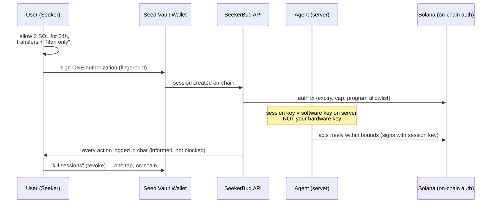

# SeekerBud — AutoTransact

> The path from "confirm everything" to "ask once, runs forever, bounded."
> AutoTransact = autonomous transactions: the agent acts within user-approved envelopes, without per-action confirmations.

---

## 1. The problem & the promise

**Today (V1):** every spend action needs a fingerprint — by design. Seed Vault is hardware, and hardware can't sign when you're not there.

**AutoTransact (target):** you define the envelope once — *"2 SOL, 24h, transfers + Titan swaps only"* — and the agent works inside it without asking. You're **informed, not blocked**.

**The one rule that never bends:** unlimited autonomy with zero oversight = handing over your wallet. AutoTransact is always bounded, logged, and killable.

---

## 2. The autonomy ladder

```
LEVEL 0 ─ READ-ONLY (V1, shipping now)
         Balance · tokens · activity · summaries
         Confirmations: NONE (nothing to confirm)

LEVEL 1 ─ SESSION KEYS (auto-approve envelope)
         "2 SOL for 24h" → confirm ONCE → agent transfers/swaps inside
         Confirmations: 1 per session (then zero)

LEVEL 2 ─ RULES MODE (self-driving for routine stuff)
         "Swap idle USDC → SOL on Titan, max 50, keep 10 reserve"
         "Never touch BONK"
         Confirmations: only on EXCEPTIONS (new address, over cap)

LEVEL 3 ─ SCHEDULED + PROACTIVE (agent initiates)
         "Morning report at 8am" · "Alert me if SOL drops 5%"
         "Execute rule daily"
         Confirmations: zero (reads) or session-bounded (actions)
```

**We ship 0 → 1 → 2 → 3 in that order.** Each level builds on the last.

---

## 3. How Level 1 works — session keys (the core mechanism)



**The critical switch:** the *session key* is a software key — it lives on the server, so it can sign without your physical presence. Your master key never leaves Seed Vault. The session's on-chain auth *is* the leash.

**Session parameters (every one user-chosen):**

| Parameter | Example | Enforced by |
| --- | --- | --- |
| Expiry | 24h / 7 days / until revoked | on-chain |
| Spend cap | 2 SOL total | on-chain |
| Per-action cap | 0.5 SOL max each | agent logic |
| Program allowlist | System Program + Titan only | on-chain |
| Token allowlist | SOL ↔ USDC only | agent logic |
| Address allowlist | only my whitelisted addresses | agent logic |
| Kill switch | always available | on-chain revoke |

---

## 4. How Level 2 works — rules on top of sessions

A **rule** = session + a trigger + a guard:

```
RULE EXAMPLE
────────────
Name:      "Auto-invest"
Trigger:   Every Sunday 10:00 (scheduled)
Action:    Swap idle USDC → SOL via Titan
Guard:     max 50 USDC per run · keep 10 USDC reserve
           skip if SOL price > $250 (too high)
Session:   valid 90 days, max 200 USDC total
Logging:   chat + push notification after each run
```

**What the agent can decide alone:** routine operations inside the guard.
**What pauses for you (exception → ask):** new recipient addresses · over-cap amounts · market conditions outside your stated range · anything the guard can't verify.

**Rule language (in chat, natural language → structured rule):**
```
User:  "every week, move my idle USDC to SOL on Titan,
        max 50 each time, keep 10 reserve"
Agent: ⤷ Rule created: [Auto-invest]
       Guard: 50 USDC/run · 10 reserve · Titan · USDC→SOL
       Trigger: weekly (Sun 10:00)   [Confirm]
User:  [Confirm]  →  fingerprint once
Agent: ✅ Rule live. Runs Sunday 10:00. Kill anytime in chat.
```

---

## 5. Level 3 — scheduled & proactive

No new security mechanism — it composes:

| Feature | Uses | Confirmations |
| --- | --- | --- |
| Morning report (balance, price, activity summary) | Tier-0 reads (already free) | none |
| Price alerts ("SOL down 5%") | Tier-0 reads + thresholds | none |
| Auto-invest (Sunday) | Level-2 rule (session key) | once at rule creation |
| Drain guard ("if wallet > 5 SOL idle, swap 1 to USDC") | Level-2 rule | once at rule creation |

Agent-initiated conversation is just the chat loop waking up on a schedule — same `/api/chat`, same tools, same logging.

---

## 6. Trust model (what stays true at every level)

```
┌──────────────────────┬──────────────────────────────┬─────────────────────────┐
│ Secret               │ Who has it                   │ Can it sign?            │
├──────────────────────┼──────────────────────────────┼─────────────────────────┤
│ Seed Vault key       │ hardware only                │ YES — user-approved     │
│                      │                              │ only                     │
│ Session key          │ server (per session)         │ YES — within session    │
│                      │                              │ bounds ONLY              │
│ Agent keypair        │ server (throwaway)           │ NO — no funds, reads    │
│                      │                              │ only                     │
│ Payer wallet (x402)  │ server (small balance)       │ x402 USDC payments only │
│                      │                              │ (bounded by balance)    │
└──────────────────────┴──────────────────────────────┴─────────────────────────┘

Damage worst-case if server compromised:
  = session caps + payer balance  (bounded)
  NEVER = user wallet             (hardware)
```

**Non-negotiables:** kill switch always one tap away · every autonomous action logged in chat · caps enforced on-chain, not just in app code · user can view/revoke every session from one screen.

---

## 7. Roadmap — how we get there

```
NOW (V1, shipping)                     ▶ every action confirmed
│
│  M4 · Transfer flow (manual confirm) ✓ (see todo.md)
│
├────────────── PHASE A ──────────────
│  Autonomy foundation (read-side)
│  • Tier-0 scheduled reads: morning report, price alerts
│  • Chat: "remind me / report every morning" → scheduler
│  • NO new signing surface — zero risk, ships safe
│  Done when: morning report lands in chat without a tap
│
├────────────── PHASE B ──────────────
│  Session keys (the big one)
│  • Pick session/token-auth program (verify current best on Solana)
│  • Mobile: session manager screen (create/view/revoke)
│  • Backend: session key store (server), auth verify, guard checks
│  • Agent: transfer/swap tools gated on active session + guard
│  • Chat UX: "allow 2 SOL for 24h…" → one fingerprint → live
│  Done when: user authorizes once, agent transfers within cap
│
├────────────── PHASE C ──────────────
│  Rules mode
│  • Rule parser: natural language → {trigger, action, guards}
│  • Scheduler (cron-like) executing rules
│  • Exception routing: what pauses for the user vs. auto
│  • Titan swap integration lands here (Titan Prime API / fallback Jupiter)
│  Done when: "auto-invest every Sunday" runs on its own
│
└────────────── PHASE D ──────────────
    Hardening + polish
    • Simulation mode (dry-run all rules before real spend)
    • Push notifications per autonomous action
    • Audits: session store encryption, revocation race tests
    • dApp Store ship
```

---

## 8. Build checklist (per phase)

### Phase A — scheduled reads
- [ ] Scheduler service (cron) in backend
- [ ] Agent can run tool-calling loop on schedule (no user message)
- [ ] Morning report prompt + template
- [ ] Price alert thresholds (SOL via RPC/price feed)
- [ ] Chat shows "scheduled task ran" messages
- [ ] No signing surface added — verify with test

### Phase B — session keys
- [ ] Research + pin the session/token-auth program + SDK
- [ ] On-chain session create/verify/revoke functions
- [ ] Server session store (encrypted, per user)
- [ ] Guard checks: expiry · caps · allowlists (fail closed)
- [ ] Session manager screen (list, details, revoke)
- [ ] Chat intent: "allow X for Y" → session proposal card → fingerprint
- [ ] Transfer/swap tools only sign with session key when guards pass
- [ ] Kill-switch test: revoke → in-flight agent tx fails

### Phase C — rules
- [ ] Rule schema + NL→rule parser (LLM-guided, human-confirmed)
- [ ] Trigger engine (weekly/daily/event)
- [ ] Exception routing (asks user on exceptions)
- [ ] Titan swap integration (Prime API; Jupiter fallback)
- [ ] Guard enforcement in every rule execution path

### Phase D — hardening
- [ ] Dry-run/simulation toggle for every rule
- [ ] Push notifications on autonomous actions
- [ ] Revocation race test (agent signing while user revokes)
- [ ] Session store encryption + rotation
- [ ] End-to-end demo: create rule → runs weekly → kill switch

---

## 9. Demo script (Phase D end-state)

```
1. "Connect my wallet"                     → fingerprint
2. "What's my balance?"                    → instant, free
3. "Allow 2 SOL for 24h, Titan only"       → fingerprint ONCE
4. "Swap 0.3 SOL to USDC on Titan"         → runs, no confirm, logged
5. "Auto-invest every Sunday, max 50 USDC,
    keep 10 reserve"                       → fingerprint ONCE
6. Simulated Sunday: rule runs, chat + push show result
7. "Kill all sessions"                     → one tap, agent goes dead
8. Verify: agent now refuses everything    → "sessions revoked"
```

---

## 10. Related docs

- `README.md` — §5.2 autonomous mode (concept + limits table)
- `architecture.md` — V2 boxes (session service, scheduler, Titan tool)
- `x402.md` — paying for the brain (composes: one session = swaps + brain payments)
- `ui.md` — ActionCard, settings/session screens
- `todo.md` — V2 backlog
