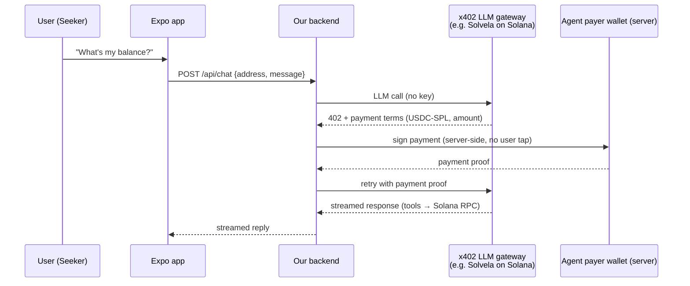

# SeekerBud x402 — Paying for the AI brain without API keys

> **Goal:** users talk to the agent, and the LLM calls get paid in USDC via **x402** — no developer OpenAI key, no signup, no subscription. The user's wallet (or a prepaid agent wallet) pays per request.

---

## 1. What x402 is (30 seconds)

x402 is an open payment protocol (built by Coinbase, now the x402 Foundation) that gives HTTP status **402 "Payment Required"** a real job: software pays for API calls in stablecoins, machine-to-machine, per request.

```text
Request → Server: "402 Payment Required: pay $0.004 USDC"
       → Client signs a USDC payment
       → Retries with payment proof
       → Server settles on-chain (via facilitator) → returns data
```

Live on Solana (USDC-SPL), plus Base/Polygon/Arbitrum/World. Stripe ships native x402 (Machine Payments, preview). Facilitator = Coinbase CDP (free tier ~1,000 tx/mo, then ~$0.001/tx). Gateways typically add 1–3% on top of the model's raw cost.

**Why it fits SeekerBud:** our backend wants *zero standing credentials*. The user's wallet *is* the billing account. Chat message in, cents out, no key.

---

## 2. Onboarding flow (new-user experience)

```mermaid
flowchart TD
    A[Open SeekerBud] --> B[Welcome screen<br/>branding + 1-line pitch]
    B --> C[Connect Solana Wallet<br/>MWA authorize → Seed Vault]
    C --> D{Connected?}
    D -->|no| C
    D -->|yes| E[Profile setup<br/>display name / .skr if available]
    E --> F[Capability intro<br/>balance · tokens · activity · transfers<br/>+ "AI pays itself per message"]
    F --> G[Funding choice]
    G --> H[Pay-as-you-go<br/>sign payments per message]
    G --> I[Prepaid agent wallet<br/>one top-up, then seamless]
    H --> J[Chat]
    I --> J
```

| Step | What happens | Tech |
| --- | --- | --- |
| Welcome | Branding, pitch, one button | `OnboardingScreen` |
| Connect | MWA `authorize` → Seed Vault fingerprint | `@solana-mobile/wallet-adapter-expo` |
| Profile | Display name; read `.skr`/Genesis Token if present | MWA + RPC |
| Funding | Choose pay-as-you-go **or** prepaid top-up | MWA sign transfer |
| Chat | First message unlocks full UI | — |

**No keys, no forms, no signup.** The wallet is the account.

---

## 3. The two payment modes

| | A. Pay-as-you-go (user signs) | B. Prepaid agent wallet (server signs) |
| --- | --- | --- |
| Who signs the USDC payment | User's Seed Vault, per message (fingerprint) | Server-side payer wallet |
| Server holds keys? | **No** — purest x402 story | One funded USDC wallet (balance = max loss) |
| UX | Tap to pay each message (~$0.01) | Seamless; funded by one top-up |
| Cost to run | — | We fund it for the demo |
| Best for | Production / monetized product | **MVP & hackathon demo** (recommended) |

**Recommendation:** build **B for the MVP** (dev-funded payer wallet, zero user friction in demos), and keep **A as the switch** (one env flag) for the real product story.

---

## 4. Chat request lifecycle (Mode B — MVP)



**Cost per message:** LLM (e.g. gpt-4o-mini class) ≈ $0.002–$0.01 + gateway 1–3% + facilitator ~$0.001. A demo day costs pennies.

**Mode A swaps one box:** the *user's Seed Vault* signs the payment instead of the server wallet — via MWA `signAndSendTransactions` on a USDC transfer returned by the gateway's 402.

---

## 5. Environment & config

```env
# Payment mode: "prepaid" (B, default for MVP) | "user" (A)
X402_MODE=prepaid

# Mode B only — agent payer wallet (small funded balance, NOT the user's wallet)
X402_PAYER_PRIVATE_KEY=...

# Gateway endpoints (verify current URLs at integration time)
X402_LLM_GATEWAY_URL=https://...
X402_DATA_GATEWAY_URL=https://...          # optional: Birdeye x402 for prices/metadata
X402_FACILITATOR_URL=https://api.cdp.coinbase.com/platform/v2/x402

# Fallback (emergency only — NOT on the day-1 path)
OPENAI_API_KEY=sk-...                       # unused in normal operation; only if the gateway is down

# Existing
SOLANA_RPC_URL=https://api.devnet.solana.com
```

**Key hygiene:**
- The payer wallet is **separate from every user wallet** — never mix.
- Keep the balance small; a drained payer wallet is a bounded loss (same principle as session keys).
- Test on **devnet/testnet** first (gateway test networks, test USDC).

---

## 6. Risks & mitigations

| Risk | Mitigation |
| --- | --- |
| Signed payment = bearer credential | Replay protection in protocol; payer wallet holds tiny balance; rotate regularly |
| Gateway quality/uptime (young projects) | Verify on testnet; keep OpenAI-key fallback switch for the MVP |
| User confusion about paying per message | Transparent cost line on every message; prepaid mode avoids taps |
| Solana vs EVM gateway mismatch | Prefer Solana-native gateways (USDC-SPL, e.g. Solvela); Birdeye data endpoints already Solana x402 |
| Facilitator limits | Free tier (1k tx/mo) is fine for MVP; batch/settle as needed later |

---

## 7. MVP plan (what actually ships) — x402 from day 1

1. Onboarding screen: Welcome → Connect (MWA) → profile → funding choice → Chat
2. Chat runs on **x402 from day 1** — Mode B (server payer wallet) against a Solana-native x402 LLM gateway
3. **No OpenAI key in the architecture.** OpenAI only exists if the gateway itself routes to it — and even then we hold no key
4. Cost display per message (transparency, part of the story)
5. Demo script updated: connect → one top-up → chat → transfer → done

## 8. V2

- Mode A (user-pays) as the default — the "no key, pay as you chat" product story
- x402 for data too (Birdeye prices/metadata) → drop all data API keys
- Composes with session keys: one session authorizes agent swaps **and** its own brain payments
